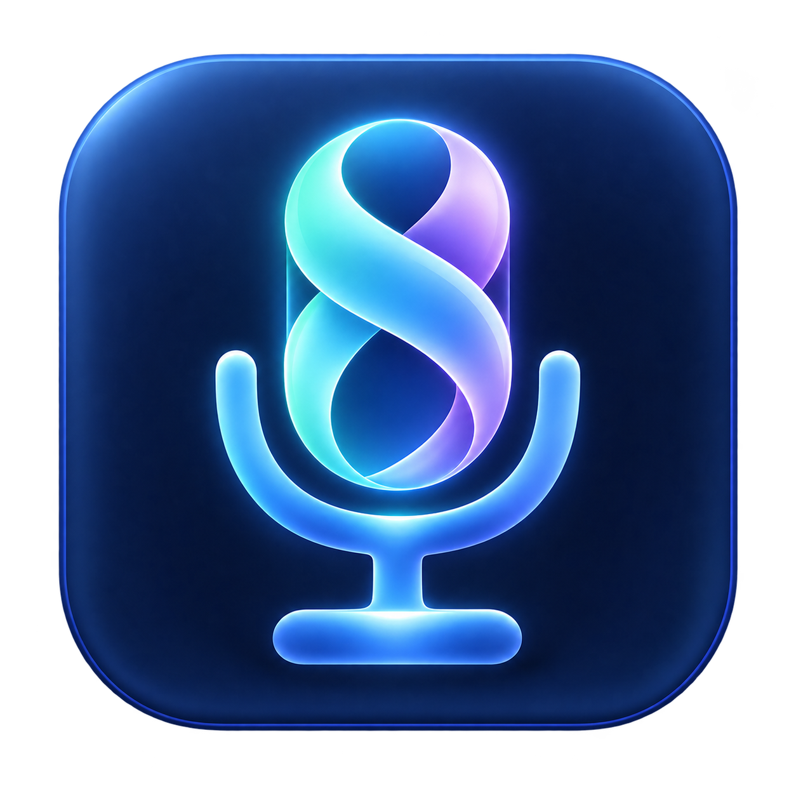

  

<h1 align="center">MicWeave</h1>

<strong>Your voice and audio. Woven together.</strong> One clearly labeled microphone for your calls, recordings, and games.

Windows 11 x64 · Open source · MIT license

  <a href="docs/USING.md">How to use</a> ·
  <a href="#see-it-in-action">Screenshots</a> ·
  <a href="docs/BUILDING.md">Build the preview</a> ·
  <a href="https://github.com/est1994ap-del/MicWeave/issues">Feedback</a>

Share a song while you talk. Bring another audio input into a recording. Combine
the sources you want, then select **MicWeave Microphone** in your calling,
recording, or game app. Your music still plays through your normal speakers or
headphones. No VoiceMeeter setup required.

> **Source preview — not an installer release yet.** The app and microphone path
> work on the development PC. You can browse or build the source today; there is
> no public ready-to-install download yet. [What remains before release →](docs/RELEASING.md)

## See it in action

  

*Real app, real meters. These screenshots show the running development build,
a physical microphone, and a local test-audio program. “MicWeave Audio Demo” is
that temporary test source, not an included music player. No meter bars were
painted in or generated.*

## Choose what people hear

- **Your microphone, your choice.** Select the physical mic you want to use.
- **Share just one program.** Pick a music player or browser without sharing every desktop sound.
- **Need more? Add another source.** Each card gets its own Active switch, meter, mute, and level.
- **Keep your voice when the music stops.** Unroute program audio independently of your mic.
- **See each source and the final mix.** Live frequency bars make audio activity visible.
- **Keep listening normally.** MicWeave captures a copy of program audio; it does not move it away from your speakers.
- **A normal Windows window.** Drag, resize, minimize, maximize, or put another window in front of it.

## Quick start

These steps apply **after building the preview and setting up its virtual
microphone**. Start with the [build guide](docs/BUILDING.md) and
[first-time setup](docs/USING.md#first-time-setup) if needed.

1. **Choose your mic.** In **MICROPHONE → Input source**, select your physical microphone. Keep its Active switch on.
2. **Choose your music or other audio.** Start playback in that program. In **PROGRAM AUDIO → Audio source**, choose its **Program** entry. Click ↻ if it is missing.
3. **Share it.** Click **Route**, or turn on that card's Active switch. Adjust its **Level** so your voice stays easy to hear.
4. **Select the receiving microphone.** In Discord, Zoom, a recorder, or a game, choose **MicWeave Microphone** as the microphone/input device. Keep your normal speakers or headphones as the playback/output device.
5. **Stop sharing the program.** Click **Unroute** or switch that source off. Your microphone can keep working. To stop the entire mix, use **Stop** in **FINAL MIX**.

For games using push-to-talk, hold the game's usual talk key to transmit the mix.
Check the receiving app's microphone test too: moving bars in MicWeave alone do
not prove that the other app is receiving it.

**[Full walkthrough, control guide, and troubleshooting →](docs/USING.md)**

## More than one source

Click **Add another source**, choose another program or input, and enable its
Active switch when you want it included. Sources can be previewed while off.

<strong>View screenshot: an additional input with its own controls</strong>

Here, the second input is **PREVIEW ONLY**: its meter is active, but its sound is
not included in the final mix until its Active switch is enabled.

<strong>View screenshot: stop sharing the program, keep the mic</strong>

The program keeps playing locally and its meter keeps moving. **Unroute** removes
its direct contribution to the shared microphone without stopping your mic.
Use headphones if you do not want your physical mic picking up speaker sound.

## Get the source and custom icon

- **Developers:** [Build instructions](docs/BUILDING.md) · [Source ZIP](https://github.com/est1994ap-del/MicWeave/archive/refs/heads/main.zip) · [Build checks](https://github.com/est1994ap-del/MicWeave/actions)
- **App artwork:** [Custom icon PNG](docs/images/micweave-icon.png) · [Windows icon ICO](https://github.com/est1994ap-del/MicWeave/blob/main/src/GameMusicShare.App/Assets/MicWeave.ico)
- **Following the project:** Star this repository or use GitHub's Watch menu for updates. [Report an issue or suggest a feature](https://github.com/est1994ap-del/MicWeave/issues).

The custom icon is already included in the app and development installer.
For a manually created Windows shortcut, see the [desktop shortcut steps](docs/USING.md#desktop-shortcut-and-custom-icon).

Before distributing an installer, we must resolve the USB device identity and
complete clean-computer install, restart, upgrade, and removal tests.
See [release gates](docs/RELEASING.md) and [device identity](docs/DEVICE-IDENTITY.md).
Do not redistribute development binaries using the provisional USB identifiers.
This preview is not a certified or independently audited product.

## How the microphone works

MicWeave does **not** need VoiceMeeter or its own newly signed kernel driver.
It still needs an existing driver: the Microsoft-signed, open-source
[usbip-win2 transport](https://github.com/vadimgrn/usbip-win2).
The app and its helper run locally. The transport presents a virtual USB device,
and Windows' built-in USB Audio driver exposes one capture endpoint.
No additional playback endpoint is created. Secure Boot need not be disabled.

First-time transport installation needs administrator permission and may need a
restart. It can temporarily reconnect USB devices, including a mouse or keyboard:
save your work first. The current installer/helper version is pinned and verified
by SHA-256, not downloaded from an unversioned "latest" URL.

## Build and test

See [BUILDING.md](docs/BUILDING.md). There are no prebuilt executables in this
source repository. Windows 11 x64, .NET 8 SDK, Go, and PowerShell 7 are required.
No driver development kit, paid certificate, or test-signing mode is required
to build the user-mode app/helper.

## Privacy and limitations

Audio stays on this computer; there is no telemetry, account, or cloud relay.
Microphone previews capture audio while active, including before program routing.
Any app allowed by Windows to record a microphone can record MicWeave's output.
MicWeave is not a boundary against malicious software running as you or an
administrator. Close it when you do not want it capturing.

The app stores device/source choices and window position in
`%LOCALAPPDATA%\MicWeave`. Logs and explicitly requested diagnostic reports may
contain device identifiers, window titles, and file paths. Review/redact them
before sharing. The public package excludes all development-machine reports.

Per-program capture may not work for protected media or apps Windows cannot
capture. Calling apps may suppress music with their own noise reduction; check
their music/original-sound settings. Audio latency and compatibility still need
broader testing. No macOS, Linux, or ARM64 release is claimed.

## License

Original MicWeave code is under the [MIT license](LICENSE). Retained upstream
code, fonts, and dependencies keep their own licenses; see
[THIRD_PARTY_NOTICES.md](THIRD_PARTY_NOTICES.md).

The internal `GameMusicShare` project/namespace is retained to avoid breaking
build and resource references; the app's public name is MicWeave.
