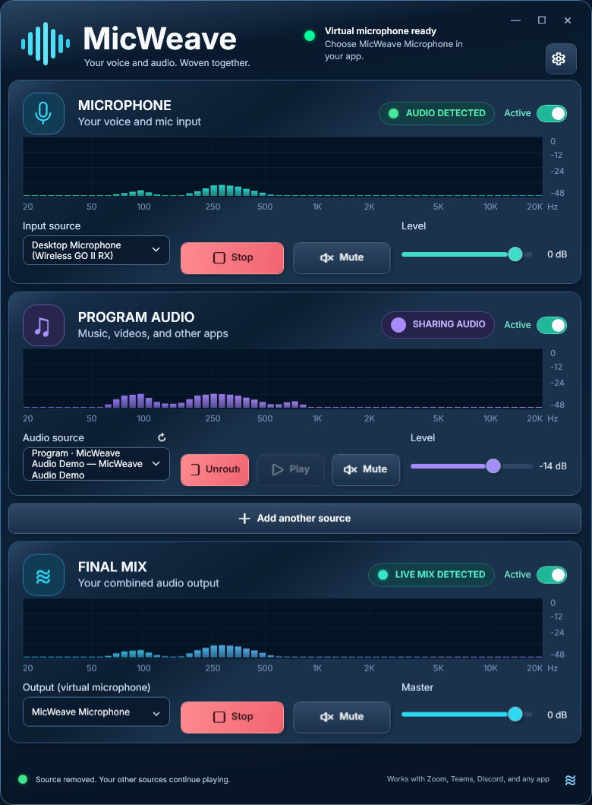
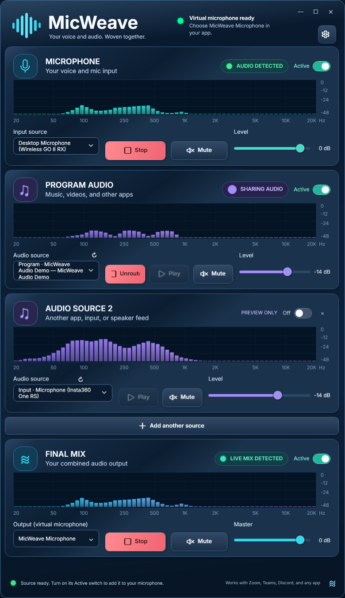
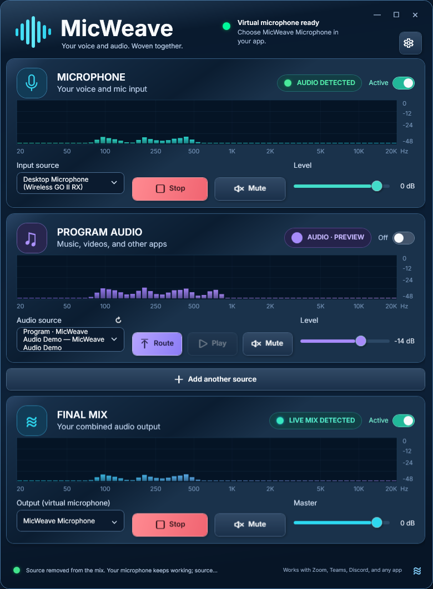

# Using MicWeave

[← Back to MicWeave](../README.md)

MicWeave combines your physical microphone with the audio sources you choose.
The result appears as **MicWeave Microphone** in Windows, so another app can
select it just like a microphone. You do not route audio *into* the physical mic:
your physical mic is one source, and MicWeave Microphone is the combined output.

> **Availability:** This is a Windows 11 x64 source preview, not a public
> ready-to-install release. These instructions describe the current development
> build. Downloading the source ZIP does not install the app or its microphone.

## First-time setup

1. Follow [Building MicWeave](BUILDING.md). The resulting app is
   `artifacts/publish/MicWeave.exe`. Keep its accompanying files with it.
2. Open **MicWeave.exe**. The header tells you whether its virtual microphone is ready.
3. If it says **Virtual microphone not installed**, click the **gear** in the top
   right. Development setup uses the existing signed USB transport, then connects
   MicWeave's virtual microphone. It may request administrator permission and a
   restart. Save your work first: transport installation can briefly reconnect
   USB devices, including a mouse or keyboard. Do not disable Secure Boot.
4. Once the header says **Virtual microphone ready**, select your physical mic
   and sources using the steps below.

If the transport is already installed, opening MicWeave attempts to reconnect
its microphone automatically. If setup still fails, read the bottom status
message; do not keep reinstalling or changing unrelated Windows audio devices.
The [release checklist](RELEASING.md) explains why broader installation testing
is still required before this becomes a public installer.

## Share a program, such as Spotify

1. **Start your audio normally.** Open the music player or browser and play
   something. Keep it on the speakers or headphones you normally use.
2. **Choose your voice microphone.** In **MICROPHONE → Input source**, select the
   actual microphone you want, not MicWeave Microphone. Turn on **Active**; use
   **Start** if capture is stopped. Speak and check its meter.
3. **Choose the program.** Under **PROGRAM AUDIO → Audio source**, choose the
   **Program · Spotify** entry, for example. Use the small **↻** refresh button
   if a newly opened app is missing. Starting playback can help Windows list it.
4. **Check the preview.** The program's bars should move when it plays. A
   preview alone does not share it. Click **Route** or switch its **Active**
   toggle on to include it in MicWeave Microphone.
5. **Balance voice and music.** Use the program's **Level** slider. Start with
   music quieter than your voice; the default program level is −14 dB.
   “dB” means decibels: a more negative number makes that source quieter.
6. **Choose MicWeave in the receiving app.** Open that app's voice/audio
   settings and set its microphone or input device to **MicWeave Microphone**.
   Leave its speaker/output device set to your regular speakers or headphones.
7. **Verify at the destination.** Use that app's mic test, level meter, or a
   short recording. For push-to-talk, hold the receiving app's usual talk key.

This is a real running-build screenshot. The selected **MicWeave Audio Demo**
program played locally synthesized audio for the capture; it is not an included
music player. The meters show actual microphone, program, and output samples.
The screenshots demonstrate the app's state, not certification of every receiving app.

## What the source menus mean

| Choice | What it captures | When to use it |
| --- | --- | --- |
| **MICROPHONE → Input source** | The physical microphone selected for your voice | Your USB mic, headset mic, or another recording input |
| **Program · …** | Audio from that selected program | Share Spotify or a browser without sharing unrelated desktop sounds |
| **Input · …** | Another available recording input | Add a second mic, interface input, or other input Windows exposes |
| **Speakers · … (all audio)** | Everything playing through that playback device | Share an entire output intentionally; this can include notifications and callers |

Prefer **Program** when you only want one app. Capturing **Speakers (all audio)**
can feed your call partner's voice back into the call. Do not add both a program
and the speaker feed containing that same program: that would double its sound.
The app also prevents selecting the same input/program in multiple source cards.

## Add another source

1. Click **Add another source** below the program-audio cards.
2. Pick another program, **Input**, or **Speakers** entry in the new card.
3. Preview its meter, adjust **Level**, and turn on its top-right **Active** switch.
4. Turn the switch off to remove only that source from the mix. Use **×** on
   the card to remove the extra source completely.

Each card has independent controls. In this screenshot, the additional physical
input is being previewed with its Active switch **off**; it is not being shared.

## Route, mute, pause, and stop are different

| Control | What happens |
| --- | --- |
| **Route / program Active on** | Adds the selected program to the shared microphone; starts final sending if needed |
| **Unroute / program Active off** | Removes that program from the mix; local playback and its preview can continue |
| **Microphone Active off / Mute** | Silences that mic in the mix; its preview capture can remain active |
| **Microphone Stop** | Stops capturing that physical microphone |
| **Play / Pause** | Requests playback control in a compatible program; unavailable for physical inputs or programs without Windows media controls |
| **Source Mute** | Silences that source in the mix without pausing its player |
| **Level** | Changes one source's contribution to the mix, not the program's normal speaker volume |
| **FINAL MIX → Master** | Changes the level of the entire mixed output |
| **FINAL MIX → Mute** | Silences the combined microphone output while capture can continue |
| **FINAL MIX → Stop / Active off** | Stops sending the whole mix; source previews can remain active |
| **Close the window** | Stops MicWeave's captures and audio sending |

**AUDIO · PREVIEW** or **PREVIEW ONLY** means that source is visible to MicWeave
but is not directly included in the shared mix. Source meters are measured
before their level/mute controls, so a muted source can still show moving bars.
**LIVE MIX DETECTED** indicates activity in MicWeave's final output, not proof
that a separate calling app has selected or is receiving it.

Selections and levels are remembered. Program-source sharing starts off when
you reopen MicWeave, so activate the sources you intend to share again.
Your microphone may begin capturing automatically when the app opens.

## Keep hearing your audio

You do **not** need to change Spotify's Windows output to a virtual device.
MicWeave captures a copy of the selected program's sound while its normal
playback continues. Leave Windows and the receiving app's playback output set
to your usual speakers or headphones.

Headphones help prevent your physical mic from picking up speaker sound. If you
use speakers, that sound can still enter through the physical mic even after you
unroute the program's direct audio feed.

## Desktop shortcut and custom icon

The custom MicWeave icon is embedded in `MicWeave.exe`; the development installer
also includes shortcut creation. For a manual build:

1. Open the `artifacts/publish` folder and find **MicWeave.exe**.
2. Right-click it → **Show more options → Send to → Desktop (create shortcut)**.
3. Rename the shortcut **MicWeave**, then drag it to the monitor/position you prefer.
4. If Windows shows a generic icon, right-click the shortcut → **Properties →
   Shortcut → Change Icon**. Browse to **MicWeave.exe** or the included
   **Assets/MicWeave.ico**, then Apply.

Keep the published app folder in place; moving it later can break the shortcut.
The icon files are also available in the repository:
[PNG artwork](images/micweave-icon.png) and
[Windows ICO](https://github.com/est1994ap-del/MicWeave/blob/main/src/GameMusicShare.App/Assets/MicWeave.ico).

Drag the app's top header to move the window, drag its edges to resize it, or use
the minimize/maximize buttons. It is not forced to stay above other windows.

## Troubleshooting

- **I see bars, but nobody hears the music.** Enable the program's Active switch
  or click Route; check that FINAL MIX is active and unmuted. Select **MicWeave
  Microphone** inside the receiving app. Check its own mute and push-to-talk controls.
- **The app isn't in the source list.** Open it, start playback, then click ↻.
  If it restarts, refresh and select it again. Protected media and some programs
  cannot be captured by Windows' per-program audio capture.
- **Music sounds chopped or disappears.** Voice-call noise suppression may treat
  music as noise. Look for the receiving app's music/original-sound options and
  test with its mic checker or a recording. Compatibility varies by app.
- **Play/Pause is disabled or does nothing.** Use the program's own playback
  controls. Not all programs accept Windows media-control commands; routing and
  mute are separate controls.
- **I hear an echo or doubled audio.** Avoid sharing the entire speaker feed of
  a voice call, avoid including the same sound twice, and use headphones.
- **The mix is distorted or overpowering.** Lower the individual levels and,
  if necessary, Master. The limiter reduces peaks; it is not a substitute for
  balancing loud sources.
- **MicWeave Microphone is missing.** Check the header and first-time setup above.
  After connecting it, reopen the receiving app's device list, or restart that
  app. Do not disable unrelated microphones or speakers.
- **I want all capture stopped.** Close MicWeave. Unroute, Mute, and stopping the
  final output can leave source previews capturing.

For bug reports, include your Windows version, the selected source type, and
the exact error text. Do not upload unreviewed diagnostic files: they can contain
device identifiers, window titles, and local paths. See [privacy and security](../SECURITY.md).
